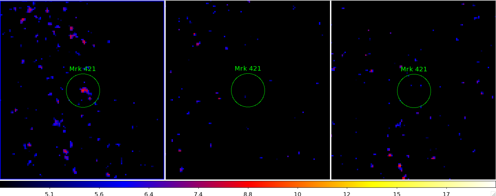
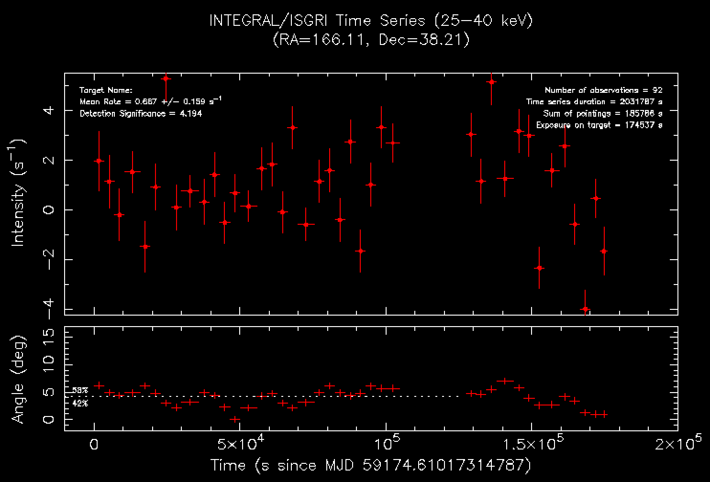

# mrk421-ibis

This repository contains the results of analysis of INTEGRAL IBIS/ISGRI data. The data is from revolutions 2300 and 2308.

## Files

The files include the list of science windows (scw.lis), mosaics, and time series.

### Mosaics

- mosa-25-40.fits
- mosa-45-60.fits
- mosa-60-100.fits

### Time Series

The time series is provided in two formats, qdp and fits:

- ts_isgri_166.114_38.209_25-40keV.qdp
- ts_isgri_166.114_38.209_25-40keV.fits

And in postscript format:

- ts_2300-2308.ps
- ts_2300.ps
- ts_2308.ps

## Results

The results show that the source is very weakly detected in the lowest energy band, 25-40 keV, and not at all in the two higher energy bands, 40-60 and 60-100 keV. The time series was therefore made only for the 25-40 keV band, and shows a very low count rate with a lot of scatter. These data do not allow for a more refined analysis. The conservative approach would be to derive and provide upper limits to the intensity of the source during these observations. 
